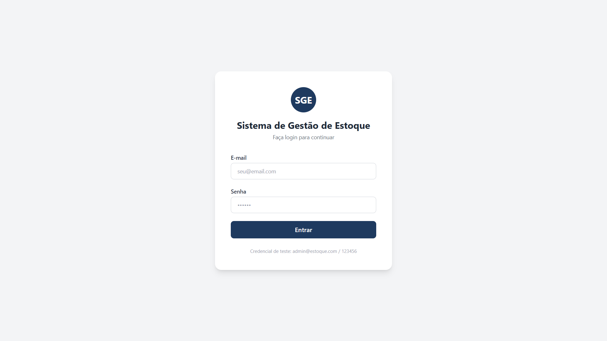
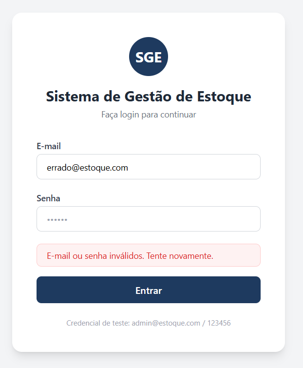
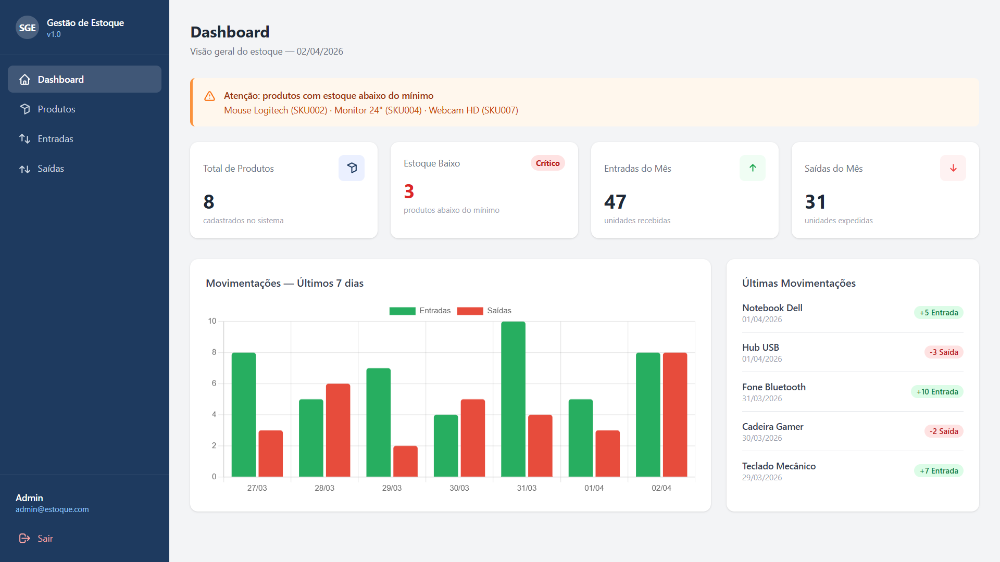
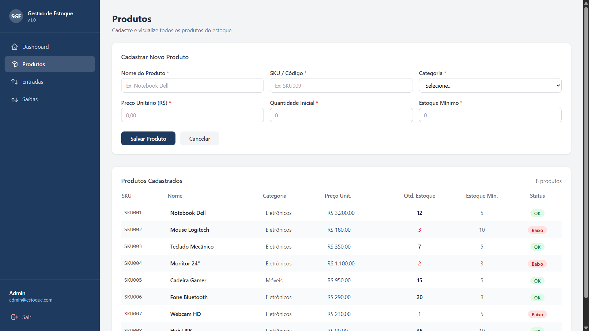
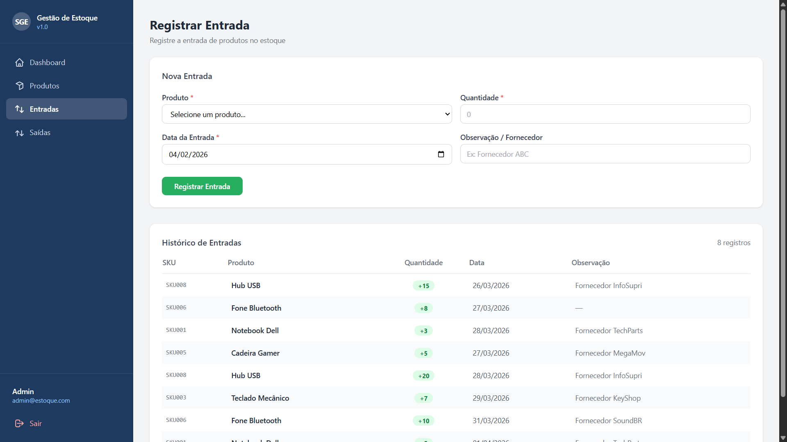
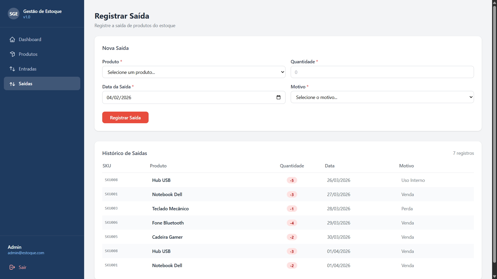

# Protótipo — Sistema de Gestão de Estoque

Protótipo interativo de alta fidelidade do Sistema de Gestão de Estoque (SGE), desenvolvido como parte da disciplina de Laboratório de Engenharia de Software (2026.1).

## Como executar

Abra o arquivo `index.html` diretamente em qualquer navegador (Chrome, Firefox, Edge). Nenhum servidor ou instalação é necessária.

## Fluxo da aplicação

### 1. Login (`index.html`)

Tela inicial do sistema. O usuário informa e-mail e senha para acessar.

- Credencial de teste: `admin@estoque.com` / `123456`
- Credenciais inválidas exibem mensagem de erro inline

Ao inserir credenciais incorretas, o sistema bloqueia o acesso e exibe o erro em destaque:

---

### 2. Dashboard (`dashboard.html`)

Visão geral do estoque com indicadores em tempo real.

- **4 cards de KPI:** Total de Produtos, Estoque Baixo (badge vermelho), Entradas do Mês, Saídas do Mês
- **Banner de alerta** listando produtos com estoque abaixo do mínimo (Mouse Logitech, Monitor 24", Webcam HD)
- **Gráfico de barras** com entradas e saídas dos últimos 7 dias (Chart.js)
- **Tabela** das 5 últimas movimentações com badges coloridos por tipo

---

### 3. Produtos (`produtos.html`)

Cadastro e listagem completa dos produtos do estoque.

- Formulário com validação inline: Nome, SKU (único), Categoria, Preço, Quantidade Inicial e Estoque Mínimo
- Tabela pré-populada com 8 produtos e **badge de status** (verde = OK / vermelho = Baixo)
- Produtos abaixo do estoque mínimo (SKU002, SKU004, SKU007) são destacados em vermelho
- Novos produtos cadastrados aparecem imediatamente na tabela

---

### 4. Entradas (`entradas.html`)

Registro de entrada de produtos no estoque.

- Select dinâmico de produto com quantidade atual visível
- Campos: Quantidade, Data (padrão: hoje) e Observação/Fornecedor
- Novo registro aparece imediatamente no histórico com badge verde `+N`
- Toast de confirmação exibido após o registro

---

### 5. Saídas (`saidas.html`)

Registro de saída de produtos do estoque.

- Select de produto com validação de saldo disponível
- Campos: Quantidade, Data e Motivo (Venda, Perda, Devolução, Uso Interno)
- **Bloqueio automático** se a quantidade solicitada exceder o saldo disponível
- Toast de alerta laranja disparado quando o saldo cai abaixo do estoque mínimo
- Histórico de saídas com badge vermelho `-N`

---

## Requisitos funcionais cobertos

| Tela | Requisito |
|------|-----------|
| Login | RF09 — Autenticação de usuário |
| Dashboard | RF06 — Visualização do painel de estoque |
| Produtos | RF01 — Cadastro de produtos |
| Entradas | RF03 — Registro de entrada de produtos |
| Saídas | RF04 — Registro de saída de produtos |
